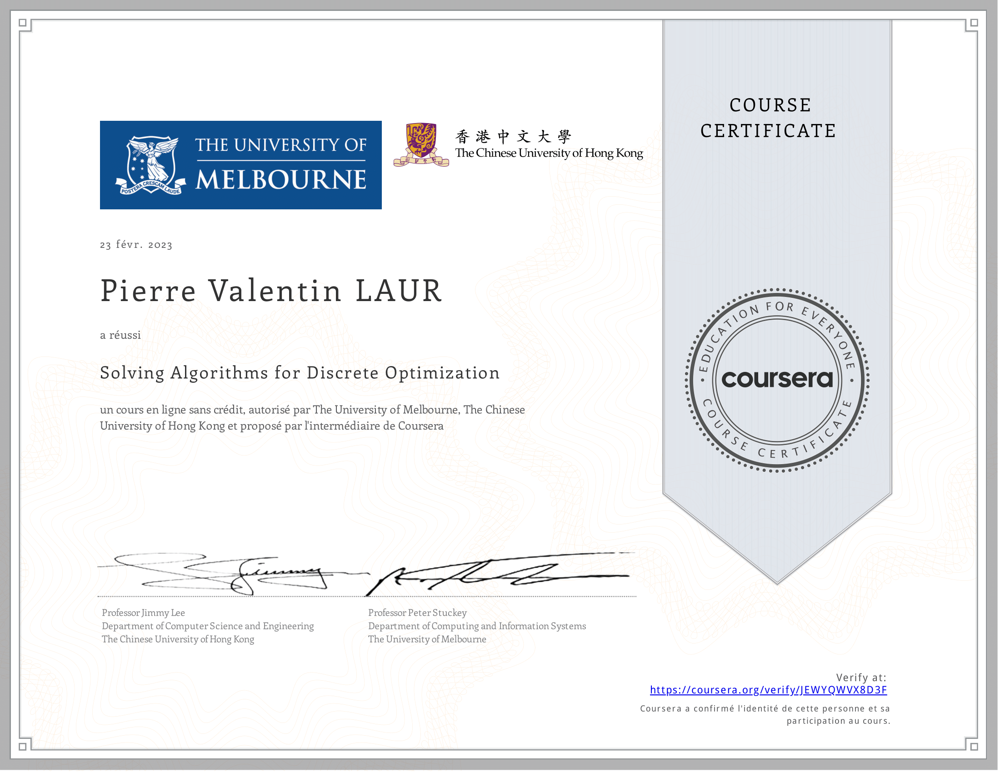

# Advanced-Modeling-MiniZinc
My work on the course [Advanced Modeling for Discrete Optimization](https://www.coursera.org/learn/advanced-modeling/). A course on how to solve advanced scheduling & packing problems with Constraint Programming in the MiniZinc language. Taught by Peter Stuckey & Jimmy Lee.

